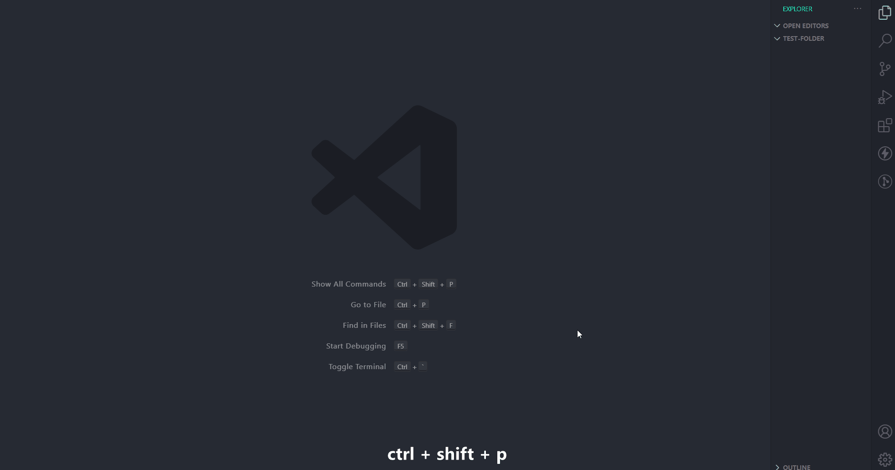
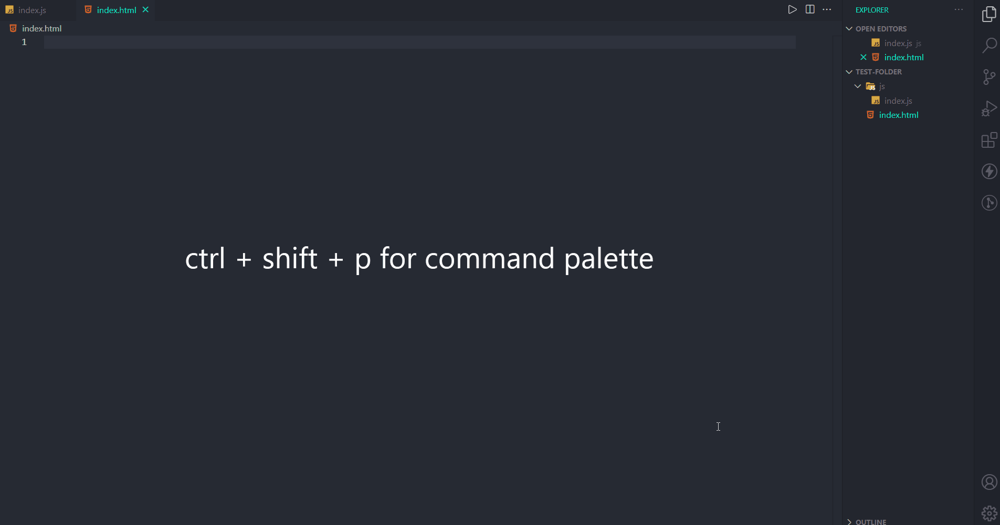
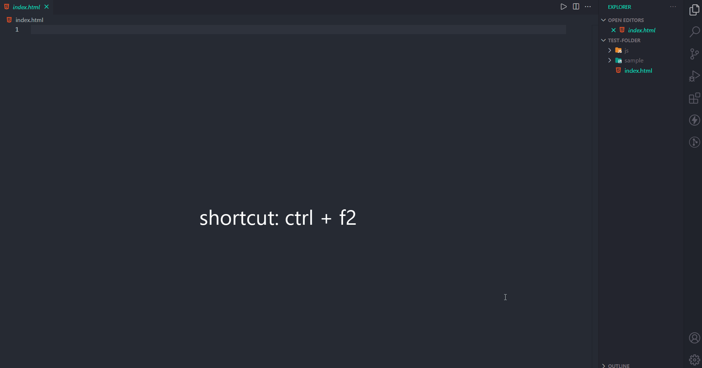

## FILE-MANAGER

>  vscode extension for managing files

  * __CREATE MULTIPLE FILES__
    * *ctrl+shift+p* to open the *command palette* > select command 'Make New File' or use the shortcut *ctrl+q ctrl+n*
    * select the directory in which the file is to be made.
    * input the filename.
    * you can also specify the file name as: *foldername/filename* where 'foldername' may or may not be present in the selected directory.
    * you can make multiple files in the selected directory. a space will act a delimiter.
    
     

  * __CREATE MULTIPLE DIRECTORIES__
    * *ctrl+shift+p* to open the *command palette* > select command 'Create New Directory' or use the shortcut *ctrl+q ctrl+d*
    * select the directory in which the new folder is to be made.
    * input the foldername.
    * you can also specify the file name as: *foldername/foldername2* where 'foldername' may or may not be present in the selected directory.
    * you can make multiple directory in the selected directory. a space will act a delimiter.
    
     

  * __DELETE MULTIPLE FILES__
    * *ctrl+shfit+p* to open the *command palette* > select command 'Delete File' or use the shortcut *alt+d alt+f*
    * select the files. use arrow keys to move up/down and spacebar to select. after selecting press enter or click on 'ok'.
    * a popup will appear at the bottom right. Click on 'confirm' to successfully delete selected items.
    * press enter to proceed or escape to cancel.
     

  * __DELETE MULTIPLE DIRECTORIES__
    * *ctrl+shfit+p* to open the *command palette* > select command 'Delete Directory' or use the shortcut *alt+d alt+d*
    * select the directories. use arrow keys to move up/down and spacebar to select. after selecting press enter or click on 'ok'.
    * a popup will appear at the bottom right. Click on 'confirm' to successfully delete selected items.
    * press enter to proceed or escape to cancel.
     

  * __RENAME FILE__
    * *ctrl+shift+p* to open the *command palette* > select command 'Rename File'.
    * select the file you want to rename.
    * input new name. press enter to proceed or escape to cancel.
     

  * __RENAME DIRECTORY__
    * *ctrl+shift+p* to open the *command palette* > select command 'Rename Directory'.
    * select the directory you want to rename.
    * input new name. press enter to proceed or escape to cancel.
     

  * __RENAME CURRENT FILE__
    * *ctrl+shift+p* to open the *command palette* > select command 'Rename Current FIle' or use the shorcut *ctrl+f2*.
    * input the new name for the file.
    * press enter to proceed or escape to cancel.
    
     

  * __MOVING FILE__
    * *ctrl+shift+p* to open the *command palette* > select command 'Move File'.
    * select the file you want to move.
    * select the destination folder for the selected file.
    * press enter to proceed and escape to cancel.
     

  * __MOVING DIRECTORY__
    * *ctrl+shift+p* to open the *command palette* > select command 'Move Directory'.
    * select the directory you want to move.
    * select the destination folder for the selected directory.
    * press enter to proceed and escape to cancel.